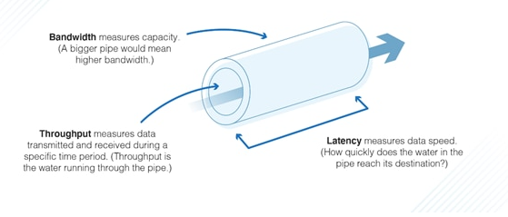
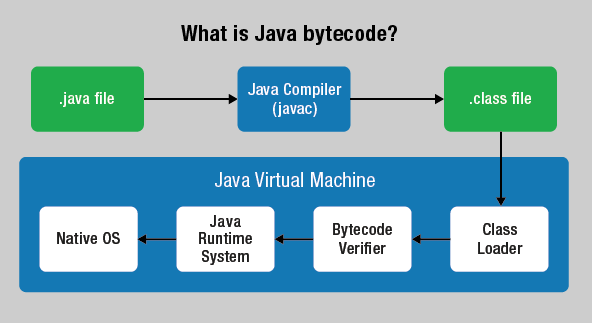
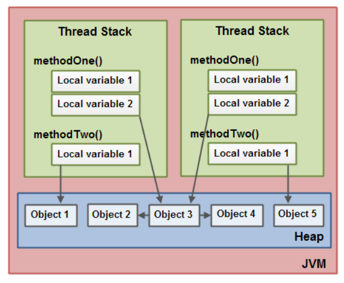

# Java Performance

> This is a Java course to understand performance, garbage collection and JVM tuning techniques.

Tools used:

- JDK 11
- Maven
- JUnit 5, Mockito
- IntelliJ IDE

## Table of contents

1. [Introduction to Java Performance](https://github.com/backstreetbrogrammer/39_JavaPerformance#chapter-01-introduction-to-java-performance)
    - [Virtual machine optimization methods](https://github.com/backstreetbrogrammer/39_JavaPerformance#virtual-machine-optimization-methods)
    - [Interview Problem 1 (Merrill Lynch) - What is the difference between latency, bandwidth and throughput?](https://github.com/backstreetbrogrammer/39_JavaPerformance#interview-problem-1-merrill-lynch---what-is-the-difference-between-latency-bandwidth-and-throughput)
2. [Just In Time Compilation](https://github.com/backstreetbrogrammer/39_JavaPerformance#chapter-02-just-in-time-compilation)
    - [Interview Problem 2 (Barclays) - What is JVM warmup and how does it improve JVM performance?](https://github.com/backstreetbrogrammer/39_JavaPerformance#interview-problem-2-barclays---what-is-jvm-warmup-and-how-does-it-improve-jvm-performance)
    - [Interview Problem 3 (Point72 Hedge Fund) - Print Code Compilation](https://github.com/backstreetbrogrammer/39_JavaPerformance#interview-problem-3-point72-hedge-fund---print-code-compilation)
    - [Compilers C1 and C2](https://github.com/backstreetbrogrammer/39_JavaPerformance#compilers-c1-and-c2)
3. [Java Memory Model](https://github.com/backstreetbrogrammer/39_JavaPerformance#chapter-03-java-memory-model)
    - [Interview Problem 4 (Merrill Lunch): Predict the output of the program with explanation](https://github.com/backstreetbrogrammer/39_JavaPerformance#interview-problem-4-merrill-lunch-predict-the-output-of-the-program-with-explanation)
    - [Escaping References](https://github.com/backstreetbrogrammer/39_JavaPerformance#escaping-references)
    - [JVM memory optimizations and tuning](https://github.com/backstreetbrogrammer/39_JavaPerformance#jvm-memory-optimizations-and-tuning)
4. Garbage Collection
    - Monitoring and Tuning Heap
    - Garbage Collector Tuning
5. Performance Benchmarking
    - Using a profiler
    - Using JMH

---

## Chapter 01. Introduction to Java Performance

`Java` was historically considered slower than the fastest 3rd generation typed languages such as `C` and `C++`.

The main reason being a different language design, where after compiling, Java programs run on a `Java virtual
machine (JVM)` rather than directly on the computer's processor as `native code`, as do C and C++ programs.

Performance was a matter of concern because much business software has been written in Java after the language quickly
became popular in the late 1990s and early 2000s.

Since the late 1990s, the execution speed of Java programs improved significantly via introduction of `just-in-time
compilation (JIT)` (in 1997 for Java 1.1), the addition of language features supporting better code analysis,
and optimizations in the JVM (such as `HotSpot` becoming the default for Sun's JVM in 2000).

Hardware execution of Java `bytecode`, was also explored to offer significant performance improvements.

The performance of a Java bytecode compiled Java program depends on how optimally its given tasks are managed by the
host Java virtual machine (JVM), and how well the JVM exploits the features of the computer hardware and operating
system (OS) in doing so.

Thus, any Java performance test or comparison has to always report the version, vendor, OS and hardware architecture of
the used JVM.

In a similar manner, the performance of the equivalent natively compiled program will depend on the quality of its
generated machine code, so the test or comparison also has to report the name, version and vendor of the used compiler,
and its activated compiler optimization directives.

### Virtual machine optimization methods

Many optimizations have improved the performance of the JVM over time.

**_Just-in-time compiling_**

Early JVMs always interpreted Java bytecodes. This had a large performance penalty of between a factor 10 and 20 for
Java versus C in average applications.

To combat this, a **just-in-time (JIT) compiler** was introduced into Java 1.1.

Due to the high cost of compiling, an added system called **HotSpot** was introduced in Java 1.2 and was made the
default in
Java 1.3.

Using this framework, the Java virtual machine continually analyses program performance for hot spots which
are executed frequently or repeatedly.

These are then targeted for optimizing, leading to high performance execution with a minimum of overhead for less
performance-critical code. Some benchmarks show a 10-fold speed gain by this means.

However, due to time constraints, the compiler cannot fully optimize the program, and thus the resulting program is
slower than native code alternatives.

**_Adaptive optimizing_**

Adaptive optimizing performs dynamic recompilation of parts of a program based on the current execution profile.

With a simple implementation, an adaptive optimizer may simply make a trade-off between just-in-time compiling and
interpreting instructions.

At another level, adaptive optimizing may exploit local data conditions to optimize away branches and use inline
expansion.

A Java virtual machine like **HotSpot** can also de-optimize code formerly **JITed**.

This allows performing aggressive (and potentially unsafe) optimizations, while still being able to later de-optimize
the code and fall back to a safe path.

**_Garbage collection_**

The 1.0 and 1.1 Java virtual machines (JVMs) used a **mark-sweep** collector, which could fragment the heap after a
garbage collection.

Starting with Java 1.2, the JVMs changed to a **generational** collector, which has a much better defragmentation
behaviour.

Modern JVMs use a variety of methods that have further improved garbage collection performance.

**_Compressed Oops_**

Compressed Oops allow Java 5.0+ to address up to `32 GB` of heap with `32-bit` references.

Java does not support access to individual bytes, only objects which are `8-byte` aligned by default.

Because of this, the lowest `3 bits` of a heap reference will always be `0`.

By lowering the resolution of `32-bit` references to `8 byte` blocks, the addressable space can be increased to `32 GB`.

This significantly reduces memory use compared to using `64-bit` references as Java uses references much more than some
languages like C++.

**Java 8** supports larger alignments such as `16-byte` alignment to support up to `64 GB` with `32-bit` references.

**_Split bytecode verification_**

Before executing a class, the JVM **verifies** its Java bytecodes.

This verification is performed lazily: classes' bytecodes are only loaded and verified when the specific class is loaded
and prepared for use, and not at the beginning of the program.

However, as the Java class libraries are also regular Java classes, they must also be loaded when they are used, which
means that the start-up time of a Java program is often longer than for C++ programs, for example.

A method named **split-time verification**, first introduced in the **Java Platform, Micro Edition (J2ME)**, is used in
the JVM since Java version 6. It splits the verification of Java bytecode in two phases:

- Design-time – when compiling a class from source to bytecode
- Runtime – when loading a class

In practice, this method works by capturing knowledge that the Java compiler has of class flow and annotating the
compiled method bytecodes with a synopsis of the class flow information. This does not make runtime verification
appreciably less complex, but does allow some shortcuts.

**_Escape analysis and lock coarsening_**

Java is able to manage multithreading at the language level.

Multithreading allows programs to perform multiple processes concurrently, thus improving the performance for programs
running on computer systems with multiple processors or cores.

Also, a multithreaded application can remain responsive to input, even while performing long running tasks.

However, programs that use multithreading need to take extra care of objects shared between threads, locking access to
shared methods or blocks when they are used by one of the threads.

Locking a block or an object is a time-consuming operation due to the nature of the underlying operating system-level
operation involved.

As the Java library does not know which methods will be used by more than one thread, the standard library always locks
blocks when needed in a multithreaded environment.

Before Java 6, the virtual machine always locked objects and blocks when asked to by the program, even if there was no
risk of an object being modified by two different threads at once.

Starting with Java 6, code blocks and objects are locked only when needed.

Since version 6u23, Java includes support for escape analysis.

**_Register allocation improvements_**

Before Java 6, allocation of registers was very primitive in the client virtual machine (they did not live across
blocks), which was a problem in CPU designs which had fewer processor **registers** available, as in `x86s`.

If there are no more registers available for an operation, the compiler must copy from register to memory (or memory to
register), which takes time (registers are significantly faster to access).

However, the server virtual machine used a color-graph allocator and did not have this problem.

An optimization of register allocation was introduced in Sun's JDK 6; it was then possible to use the same registers
across blocks (when applicable), reducing accesses to the memory.

This led to a reported performance gain of about 60% in some benchmarks.

**_Class data sharing_**

Class data sharing (called CDS by Sun) is a mechanism which reduces the startup time for Java applications, and also
reduces memory footprint.

When the JRE is installed, the installer loads a set of classes from the system JAR file (the JAR file holding all the
Java class library, called rt.jar) into a private internal representation, and dumps that representation to a file,
called a **"shared archive"**.

During subsequent JVM invocations, this shared archive is memory-mapped in, saving the cost of loading those classes and
allowing much of the JVM's metadata for these classes to be shared among multiple JVM processes.

The corresponding improvement in start-up time is more obvious for small programs.

### Interview Problem 1 (Merrill Lynch) - What is the difference between latency, bandwidth and throughput?

**Water Analogy**



- **Latency** is the amount of time it takes to travel through the tube
- **Bandwidth** is how wide the tube is
- The rate of water flow is the **Throughput**

**Vehicle Analogy**

- Vehicle travel time from source to destination is **latency**
- Types of Roadways are **bandwidth**
- Number of Vehicles traveling is **throughput**

---

## Chapter 02. Just In Time Compilation

**Bytecode**

Java bytecode is the bytecode-structured instruction set of the Java virtual machine (JVM), a virtual machine that
enables a computer to run programs written in the Java programming language and several other programming languages
like Scala, Groovy, Kotlin and Java.

Java bytecode can be **interpreted** and compiled to native OS machine code by JVM to run the program.

This feature let programmers `Write once, Run anywhere (WORA)`, meaning that compiled Java code can run on all platforms
that support Java without the need to recompile.

Java applications are typically compiled to bytecode that can run on any Java virtual machine (JVM) regardless of the
underlying computer architecture.

The syntax of Java is similar to C and C++, but has fewer low-level facilities than either of them. The
Java runtime provides dynamic capabilities (such as reflection and runtime code modification) that are typically not
available in traditional compiled languages.



**Just-in-time compilation**

Just-in-time (JIT) compilation (also dynamic translation or run-time compilation) is compilation of computer code during
execution of a program at run time rather than before execution.

This may consist of source code translation but is more commonly bytecode translation to machine code, which is then
executed directly.

A system implementing a JIT compiler typically **continuously analyses** the code being executed and identifies parts of
the code where the speedup gained from compilation or recompilation would outweigh the overhead of compiling that code.

### Interview Problem 2 (Barclays) - What is JVM warmup and how does it improve JVM performance?

JVM warmup refers to having a piece of code run enough times that the JVM stops interpreting and compiles to native.

The reason is that the JVM gathers statistics about the code in question that it uses during code generation.

As JIT compiler will keep on analysing the code and compile the most used methods or blocks into native code - if it
gets enough time to do the analysis - it can improve performance.

In JVM, there are multiple threads:

- one thread is doing bytecode interpretation
- another thread is doing JIT compilation

Thus, if more time is given for code run - all the native compilation would have been completed and the code will
execute faster

If a code chunk in question is "warmed" with fake data which has different properties than the real data could
well be very good performant.

For a low latency application, we should warmup the **critical path** in our system.

We should have unit tests consisting of fake data that could be run on start up to warmup up the code and compile
the hot spots of the code to native code.

### Interview Problem 3 (Point72 Hedge Fund) - Print Code Compilation

We want to see which part of code is compiled natively.

For example, we have `PrimeNumbersGenerator` class:

```java
import java.util.ArrayList;
import java.util.List;

public class PrimeNumbersGenerator {

    private List<Integer> primes;

    private Boolean isPrime(final Integer testNumber) {
        for (int i = 2; i < testNumber; i++) {
            if (testNumber % i == 0) return false;
        }
        return true;
    }

    private Integer getNextPrimeAbove(final Integer previous) {
        Integer testNumber = previous + 1;
        while (!isPrime(testNumber)) {
            testNumber++;
        }
        return testNumber;
    }

    public void generateNumbers(final Integer max) {
        primes = new ArrayList<>();
        primes.add(2);

        Integer next = 2;
        while (primes.size() <= max) {
            next = getNextPrimeAbove(next);
            primes.add(next);
        }
        System.out.println(primes);
    }

    public static void main(final String[] args) {
        final PrimeNumbersGenerator primeNumbers = new PrimeNumbersGenerator();
        final Integer max = Integer.parseInt(args[0]);
        primeNumbers.generateNumbers(max);
    }

}
```

We can print say first 10 prime numbers: `java PrimeNumbersGenerator 10`

Output:

```
[2, 3, 5, 7, 11, 13, 17, 19, 23, 29, 31]
```

Let's print the compilation using the flag **-XX:+PrintCompilation**:

`java -XX:+PrintCompilation PrimeNumbersGenerator 5000`

Sample output:

```
    ...
    ...
    494  218 % !   4       java.util.zip.ZipFile$Source::checkUTF8 @ 4 (43 bytes)
    499  221       4       java.util.zip.ZipFile$Source::hashN (26 bytes)
    501  202       3       java.util.zip.ZipFile$Source::hashN (26 bytes)   made not entrant
    501  219       4       java.util.zip.ZipFile$Source::addEntry (33 bytes)
    502  222       3       java.lang.String::getBytes (44 bytes)
    503  213       3       java.util.zip.ZipFile$Source::addEntry (33 bytes)   made not entrant
    506  223       3       java.lang.AbstractStringBuilder::<init> (39 bytes)
    507  224       3       java.lang.StringBuilder::toString (35 bytes)
    508  225       3       java.lang.StringLatin1::lastIndexOf (40 bytes)
    509  226       3       java.lang.String::checkBoundsBeginEnd (60 bytes)
    511  227       3       java.lang.AbstractStringBuilder::newCapacity (55 bytes)
    551  228       3       java.lang.invoke.MethodType::hashCode (53 bytes)
    552  229     n 0       java.lang.Object::clone (native)   
    553  230       3       java.lang.Class::getName (18 bytes)
    556  231       4       java.lang.String::isLatin1 (19 bytes)
    557    2       3       java.lang.String::isLatin1 (19 bytes)   made not entrant
    577   77       4       java.lang.String::charAt (25 bytes)   made not entrant
    580  232       3       java.lang.String::charAt (25 bytes)
    581  233       3       java.lang.String::startsWith (138 bytes)
    582  234       3       java.lang.StringLatin1::replace (196 bytes)
    586  235       1       java.lang.Integer::intValue (5 bytes)
    587  236       1       java.lang.Boolean::booleanValue (5 bytes)
    587  237       3       com.backstreetbrogrammer.ch02_jit.PrimeNumbersGenerator::isPrime (35 bytes)
    587  238       3       java.lang.Integer::valueOf (32 bytes)
    588  239       1       java.util.ArrayList::size (5 bytes)
    589  240 %     4       com.backstreetbrogrammer.ch02_jit.PrimeNumbersGenerator::isPrime @ 2 (35 bytes)
    593  241       4       com.backstreetbrogrammer.ch02_jit.PrimeNumbersGenerator::isPrime (35 bytes)
    594  242       3       java.util.ArrayList::add (25 bytes)
    599  237       3       com.backstreetbrogrammer.ch02_jit.PrimeNumbersGenerator::isPrime (35 bytes)   made not entrant
    599  243       3       com.backstreetbrogrammer.ch02_jit.PrimeNumbersGenerator::getNextPrimeAbove (43 bytes)
    691  244       4       com.backstreetbrogrammer.ch02_jit.PrimeNumbersGenerator::getNextPrimeAbove (43 bytes)
    704  243       3       com.backstreetbrogrammer.ch02_jit.PrimeNumbersGenerator::getNextPrimeAbove (43 bytes)   made not entrant

```

Let's explain each column shown in the above output:

- **First column** is the **timer** in `ms`, that it took to run and it's cumulative. Last row is the **total time**.
- **Second column** is the **order** that the line item was run.
- **Third column** is:
    - blank
    - `n` = native
    - `s` = synchronized
    - `!` = some exception handling was going on
    - `%` = code has been natively compiled and is running in memory under the **code cache**
- **Fourth column** has a value from `0` to `4`. This corresponds as an **ENUM** to what type of compilation has taken
  place:
    - `0`: no compilation took place (code was interpreted)
    - `1 through 4`: is a range of compilation complexity (4 being greatest)
- **Fifth and final column** is the line item that was run.

### Compilers C1 and C2

There are two compilers in Java:

- `C1` handles native compilation levels `1-3`
- `C2` handles native level `4` only (which stores native compiles into the code cache).

The JVM determines the compilation level based on how often it is being run and how complex or how time-consuming it
is – through **profiling**.

As there is a tradeoff in optimizing more complex code (higher native tier/levels), it only will do this with methods
that are called more often, or have greater complexity.

**Code Cache**

Native compiled code - level 4 by C2 compiler -> its placed in the code cache.

However, the code cache size is limited. In a large application - where many methods can be compiled -> default code
cache size may be insufficient.

It may create a warning in logs:

```
VM warning: CodeCache is full. Compiler has been disabled.
```

We can print the code cache size which contains the compiled code:

`java -XX:+PrintCodeCache PrimeNumbersGenerator 5000`

Sample output:

```
CodeHeap 'non-profiled nmethods': size=120064Kb used=72Kb max_used=72Kb free=119991Kb
 bounds [0x000001374ed20000, 0x000001374ef90000, 0x0000013756260000]
CodeHeap 'profiled nmethods': size=120000Kb used=269Kb max_used=269Kb free=119730Kb
 bounds [0x00000137477f0000, 0x0000013747a60000, 0x000001374ed20000]
CodeHeap 'non-nmethods': size=5696Kb used=1058Kb max_used=1072Kb free=4637Kb
 bounds [0x0000013747260000, 0x00000137474d0000, 0x00000137477f0000]
 total_blobs=577 nmethods=235 adapters=254
 compilation: enabled
              stopped_count=0, restarted_count=0
 full_count=0
```

So, total code cache size = `(120064 + 120000 + 5696) KB` = `245760 KB` ~= `245 MB`

Used code cache size = `(72 + 269 + 1058) KB` = `1399 KB` ~= `1 MB`

There are 3 VM arguments through which we can tune JVM code cache size:

- `InitialCodeCacheSize` = code cache size when the app is started - normally around 160KB
- `ReservedCodeCacheSize` = max code cache size possible
- `CodeCacheExpansionSize` = how quickly the code cache should grow when initially full

For example, lets change the reserved code cache size to 28MB: `-XX:ReservedCodeCacheSize=28m`

`java -XX:ReservedCodeCacheSize=28m -XX:+PrintCodeCache PrimeNumbersGenerator 5000`

Sample output:

```
CodeCache: size=28672Kb used=1402Kb max_used=1416Kb free=27269Kb
 bounds [0x000001f7afcf0000, 0x000001f7aff60000, 0x000001f7b18f0000]
 total_blobs=577 nmethods=235 adapters=254
 compilation: enabled
              stopped_count=0, restarted_count=0
 full_count=0
```

**Total** code cache size is reduced to `28672 KB` ~= `28 MB` and **used** code cache size is almost same as before:
`1402 KB` or `1 MB`.

**Turning off tiered compilation**

If only want to interpret the code and not compile, then use VM flag: `-XX:-TieredCompilation`

There should NOT be any reason or use case for this and application will run very slow!

`java -XX:-TieredCompilation -XX:+PrintCompilation PrimeNumbersGenerator 5000`

Sample output:

```
    ...
    ...
    275   29             java.util.zip.ZipFile$Source::hashN (26 bytes)
    276   30   !         java.util.zip.ZipFile$Source::checkUTF8 (43 bytes)
    282   31             java.lang.String::charAt (25 bytes)
    283   32             java.lang.StringLatin1::charAt (28 bytes)
    296   33             java.util.zip.ZipUtils::SH (21 bytes)
    322   31             java.lang.String::charAt (25 bytes)   made not entrant
    325   34             java.lang.Integer::intValue (5 bytes)
    326   35             com.backstreetbrogrammer.ch02_jit.PrimeNumbersGenerator::isPrime (35 bytes)
    374   36             java.lang.Number::<init> (5 bytes)
    374   37             java.lang.Integer::<init> (10 bytes)
    375   38             java.lang.Integer::valueOf (32 bytes)
    376   39             java.lang.Boolean::booleanValue (5 bytes)
    377   40             com.backstreetbrogrammer.ch02_jit.PrimeNumbersGenerator::getNextPrimeAbove (43 bytes)
```

As seen above, there is no level 1-4 printed as it's all **interpreted** code now.

**Tuning native compilation within the JVM**

There are 2 VM flags which can be used:

- `-XX:CICompilerCount=n`
- `-XX:CompileThreshold=n`

Code is only compiled when it is called `n` number of times during the application run.

2 factors which affect native compilation within the JVM:

- no of threads involved in compilation
- threshold required for a method to run before its natively compiled and put in code cache level 4 by C2

To find no of threads used for compilation, run this command: `java -XX:+PrintFlagsFinal`

Check for `CICompilerCount` and in the output.

```
intx CICompilerCount  = 3 
...
...
intx CompileThreshold = 10000
```

So, `3` threads available for compilation and a code block or method should have been called at-least `10,000` times
to make it a candidate for compilation and put in code cache.

Another easier way to get above counts in a running java process is:

`jinfo -flag CICompilerCount <pid>`

`jinfo -flag CompileThreshold <pid>`

If we increase number of threads and compile - it does NOT make any difference if the code is small:

`java -XX:CICompilerCount=6 -XX:+PrintCompilation PrimeNumbersGenerator 5000`

By default, at-least 2 threads should be used for JVM - for compilers `C1` and `C2`.

Similarly, reducing the threshold even had worse performance in the example code!

`java -XX:CICompilerCount=6 -XX:CompileThreshold=1000 -XX:+PrintCompilation PrimeNumbersGenerator 5000`

---

## Chapter 03. Java Memory Model

The Java memory model specifies how the Java virtual machine works with the computer's memory (RAM).

The Java memory model used internally in the JVM divides memory between **thread stacks** and the **heap**.



Each thread running in the Java virtual machine has its own **thread stack**. The thread stack contains information
about what methods the thread has called to reach the current point of execution.

The thread stack also contains all local variables for each method being executed (all methods on the call stack). A
thread can only access it's own thread stack.

Local variables created by a thread are invisible to all other threads than the thread who created it. Even if two
threads are executing the exact same code, the two threads will still create the local variables of that code in each
their own thread stack. Thus, each thread has its own version of each local variable.

All local variables of primitive types (`boolean, byte, short, char, int, long, float, double`) are fully stored on the
thread stack and are thus not visible to other threads. One thread may pass a **copy** of a primitive variable to
another thread, but it cannot share the primitive local variable itself.

The **heap** contains all objects created in our Java application, regardless of what thread created the object. This
includes the object versions of the primitive types (e.g. `Byte, Integer, Long` etc.).

It does not matter if an object was created and assigned to a local variable, or created as a member variable of another
object, the object is still stored on the heap.

To summarize,

- A **local** variable may be of a **primitive** type, in which case it is totally kept on the **thread stack**.
- A **local** variable may also be a **reference to an object**. In that case the **reference** (the local variable) is
  stored on the **thread stack**, but the **object** itself if stored on the **heap**.
- An **object** may contain **methods** and these methods may contain **local variables**. These local variables are
  also stored on the **thread stack**, even if the object the method belongs to is stored on the **heap**.
- An object's **member variables** are stored on the **heap** along with the object itself. That is true both when the
  member variable is of a primitive type, and if it is a reference to an object.
- **Static** class variables are also stored on the **heap** along with the class definition.
- **Objects** on the heap can be accessed by all threads that have a reference to the object. When a thread has access
  to an object, it can also get access to that object's **member variables**. If two threads call a method on the same
  object at the same time, they will both have access to the object's member variables, but each thread will have its
  **own copy** of the local variables.

Let's look at the following example class:

```java
import java.util.ArrayList;
import java.util.List;

public class StackAndHeap {

    public static void main(final String[] args) {
        final List<String> list = new ArrayList<>();
        list.add("One");
        list.add("Two");
        list.add("Three");

        print(list);

        System.out.printf("main list: %s%n", list);
    }

    private static void print(final List<String> list) {
        final String value = list.get(1);
        list.add("Four");
        System.out.println(value);
    }

}
```

**Output**

```
Two
main list: [One, Two, Three, Four]
```

The `main` thread **stack** will store reference variable `list` and the **copy** of the same list is sent to `print()`
method.

`ArrayList` object is created in **heap** and the indices inside it are pointing to the `String` objects which are
also created on **heap** (String pool).

Please note that any updates done on the copy of the same list will be reflected on the original list as the object
itself is updated in the heap.

### Interview Problem 4 (Merrill Lunch): Predict the output of the program with explanation

Suppose we have a `BlackBox` class:

```java
public class BlackBox {
    private String secret = "A";

    public String getSecret() {
        return secret;
    }

    public void setSecret(final String secret) {
        this.secret = secret;
    }
}
```

And, this is the main class:

```java
public class MemoryTest1 {

    public static void main(final String[] args) {
        final MemoryTest1 main = new MemoryTest1();
        main.start();
    }

    public void start() {
        final String last = "Z";
        final BlackBox blackBox = new BlackBox();
        blackBox.setSecret("C");
        another(blackBox, last);
        System.out.print(blackBox.getSecret());
    }

    public void another(BlackBox blackbox1, final String newSecret) {
        newSecret.toLowerCase();
        blackbox1.setSecret("B");
        final BlackBox blackbox2 = new BlackBox();
        blackbox1 = blackbox2;
        System.out.print(blackbox1.getSecret());
        System.out.print(newSecret);
    }
}
```

Predict the output of the above program and explain the stack and heap allocations.

**Output**

```
AZB
```

### Escaping References

A Class in java can have both **primitive** and **non-primitive** type members. These instance variables are declared as
`private`, and we can only access or modify them through the defined behavior methods (`getters/setters`) of the class.

Any **primitive** values that are accessed/retrieved using a `get()` method are passed to the caller as
**pass by value**. This is an ideal case to ensure encapsulation.

However, in case of **non-primitive** field/member of a class, **heap** reference of this member is
**passed by value** to the caller.

Now, as the caller has the reference of this member, they could **modify** the actual object using the reference that
received, although the non-primitive field is declared `private` inside the class.

This is called **Escaping References** in Java.

Let's explain this with an example.

We have a `Student` class:

```java
import java.util.Objects;

public class Student {

    private final String name;
    private final int age;

    public Student(final String name, final int age) {
        this.name = name;
        this.age = age;
    }

    public String getName() {
        return name;
    }

    public int getAge() {
        return age;
    }

    @Override
    public boolean equals(final Object o) {
        if (this == o) return true;
        if (o == null || getClass() != o.getClass()) return false;
        final Student student = (Student) o;
        return age == student.age && Objects.equals(name, student.name);
    }

    @Override
    public int hashCode() {
        return Objects.hash(name, age);
    }

    @Override
    public String toString() {
        return "Student{" +
                "name='" + name + '\'' +
                ", age=" + age +
                '}';
    }
}
```

And we have a `StudentRecords` class:

```java
import java.util.HashMap;
import java.util.Map;

public class StudentRecords {

    private final Map<String, Student> records;

    public StudentRecords() {
        this.records = new HashMap<>();
    }

    public void addStudent(final Student student) {
        this.records.put(student.getName(), student);
    }

    public Map<String, Student> getStudents() {
        return this.records;
    }

}
```

Now, we want to use it in the main class:

```java
public class EscapingReferenceMain {

    public static void main(final String[] args) {
        final StudentRecords studentRecords = new StudentRecords();

        studentRecords.addStudent(new Student("John", 18));
        studentRecords.addStudent(new Student("Mary", 17));

        for (final Student student : studentRecords.getStudents().values()) {
            System.out.println(student);
        }
    }

}
```

**Output**

```
Student{name='John', age=18}
Student{name='Mary', age=17}
```

There is an escaping reference problem in the above code - in `getStudents()` method

```
    public Map<String, Student> getStudents() {
        return this.records;
    }
```

What if in the main class, the whole records get cleared by this code:

```
        final Map<String, Student> students = studentRecords.getStudents();
        students.clear();
```

Although our `private final Map<String, Student> records` is marked both `private` and `final`, it can still be
**mutated** by the client code.

**_Solution Attempt 1 - Using an iterator_**

Let's change the `StudentsRecord` class to implement `Iterable` and remove `getStudents()` method:

```java
import java.util.HashMap;
import java.util.Iterator;
import java.util.Map;

public class StudentRecordsIterable implements Iterable<Student> {

    private final Map<String, Student> records;

    public StudentRecordsIterable() {
        this.records = new HashMap<>();
    }

    public void addStudent(final Student student) {
        this.records.put(student.getName(), student);
    }

    @Override
    public Iterator<Student> iterator() {
        return records.values().iterator();
    }
}
```

Now, we can change the main class as:

```
    public static void main(final String[] args) {
        final StudentRecordsIterable studentRecords = new StudentRecordsIterable();

        studentRecords.addStudent(new Student("John", 18));
        studentRecords.addStudent(new Student("Mary", 17));

        for (final Student student : studentRecords) {
            System.out.println(student);
        }
    }
```

Output will be same.

However, there is still a problem here as `Iterator` has got `remove()` method to mutate the original map.

```
    public static void main(final String[] args) {
        final StudentRecordsIterable studentRecords = new StudentRecordsIterable();

        studentRecords.addStudent(new Student("John", 18));
        studentRecords.addStudent(new Student("Mary", 17));

        final Iterator<Student> studentIterator = studentRecords.iterator();
        studentIterator.next();
        studentIterator.remove();

        for (final Student student : studentRecords) {
            System.out.println(student);
        }
    }
```

**Output**

```
Student{name='Mary', age=17}
```

**_Solution Attempt 2 - duplicating collections_**

Let's totally remove the escaping reference and instead of returning the original collection - return a copy of the
original collection.

```
    public Map<String, Student> getStudents() {
        return new HashMap<>(this.records);
    }
```

The client can mutate only the copy of the records map but the original records map is intact in the `StudentRecords`
class.

This fixes our escaping reference problem - however there is still a caveat => this is not performant enough.

If the map is very huge - every `getStudent()` call will create a new copy of the map and occupy all the heap memory.

**_Solution Attempt 3 - using immutable collections_**

If we return the **immutable** map to the client, then it can not be mutated at all even by the client on the copy of
the original records map.

```
    public Map<String, Student> getStudents() {
        return Map.copyOf(this.records);
    }
```

`Map.copyOf()` returns an `unmodifiable Map` containing the entries of the given `Map`. The given `Map`
must not be null, and it must not contain any null keys or values. If the given `Map` is subsequently modified, the
returned `Map` will not reflect such modifications.

An important aspect of these methods is that they are **idempotent**. Copying a previously copied collection does
**NOT** make another copy.

### JVM memory optimizations and tuning


